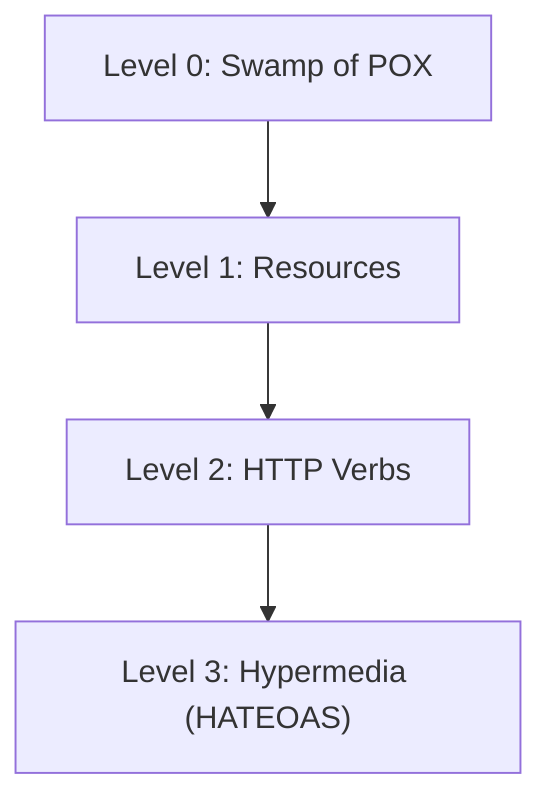

## Overview
- Framework to describe the maturity of RESTful APIs.
- Created by Leonard Richardson.
- Defines **4 levels (0–3)** of REST maturity.

---

## Levels

### Level 0 – The Swamp of POX
- Uses HTTP only as a **transport protocol**.
- Typically a single endpoint (e.g. `/api`) with one method like POST.
- Often relies on XML/JSON envelopes (SOAP, RPC style).
Level Zero represents the most basic form of building service-oriented applications.

> Level zero of maturity does not make use of any of URI, HTTP Methods, and HATEOAS capabilities.

The services at zero maturity level have a single URI and use a single HTTP method (typically POST).
For example, most SOAP Web Services use a single URI to identify an endpoint, and HTTP POST to transfer SOAP-based payloads, effectively ignoring the rest of the HTTP verbs.
Similarly, XML-RPC-based services send data as _Plain Old XML_ (POX).
These are the most primitive ways of building SOA applications with a single POST method endpoint and using XML to communicate between the client and the server.
### Level 1 – Resources
- Introduces **resources** (separate endpoints for entities).
- Example:
  - `/users`
  - `/users/123`
- Still may only use one verb (POST).
Level One introduces the use of URIs for resource identification.

> Level one of maturity **makes use of URIs**, but does not use the HTTP Methods, and HATEOAS.

At this level, services offer multiple URIs to represent various resources within the system, but they typically use a single HTTP verb, often POST, for interactions. Each resource is identified by a unique URI, enhancing the design compared to Level Zero.
However, the absence of multiple HTTP methods and HATEOAS capabilities means that the services do not fully embrace RESTful principles.

### Level 2 – HTTP Verbs
- Correct use of HTTP methods:
  - `GET` → retrieve
  - `POST` → create
  - `PUT/PATCH` → update
  - `DELETE` → delete
- Status codes used properly.
Level Two marks a significant advancement in RESTful maturity.

> Level two of maturity **makes use of URIs and HTTP Methods**, but does not use the HATEOAS.

The level two services generally host numerous URIs i.e. addressable resources. Such services support several of the HTTP verbs on each exposed resource – Create, Read, Update, and Delete (CRUD) services. Here the state of resources, typically representing business entities, can be manipulated over the network.

The designers of the level two services expect people to put some effort into mastering the APIs – generally by reading the supplied documentation.

Maturity level 2 is the most popular usecase of REST principles, which advocate using different verbs based on the HTTP request methods, while the system can have multiple resources.

### Level 3 – Hypermedia Controls (HATEOAS)
- Responses include **hypermedia links** guiding the client.
- Clients can discover and navigate the API dynamically.
- Example:
  ```json
  {
    "id": 123,
    "name": "Alice",
    "links": [
      { "rel": "self", "href": "/users/123" },
      { "rel": "orders", "href": "/users/123/orders" }
    ]
  }
  ```

Level Three represents the pinnacle of RESTful maturity according to the Richardson Maturity Model. Services at this level fully embrace all three key aspects: URIs, HTTP methods, and HATEOAS.
>Level three of maturity **makes use of all three, i.e. URIs and HTTP, and HATEOAS**.

At level three, services prioritize easy discoverability and self-descriptiveness. This level makes it easy for the responses to be self-descriptive by using HATEOAS. By utilizing HATEOAS, clients can navigate and understand the service without relying extensively on external documentation.

Level three services lead the service consumers through a trail of resources, causing application state transitions as a result.
### Summary Table

| Level | Name                 | Key Idea                        |
| ----- | -------------------- | ------------------------------- |
| 0     | Swamp of POX         | Single endpoint, HTTP as tunnel |
| 1     | Resources            | URIs for resources              |
| 2     | HTTP Verbs           | Proper use of methods & codes   |
| 3     | Hypermedia (HATEOAS) | Links drive the client          |

