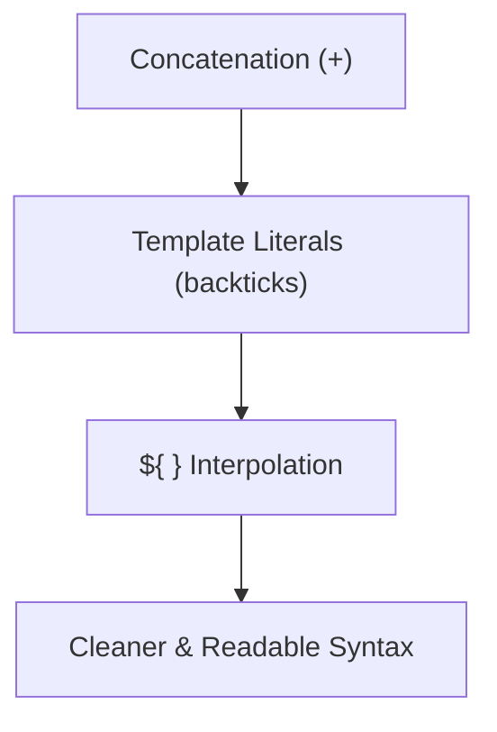

# String Interpolation in JavaScript

## Overview
- **String interpolation** = inserting variables or expressions directly into strings.
- Done with **template literals** → enclosed by backticks (`` ` ``).
- Uses the syntax:  
  ```js
  `text ${expression} more text`
  ```
## Why use it?

- Cleaner and more readable than string concatenation.
- Supports:
	- Variables
    - Expressions
    - Multiline strings
## Examples
### With Variables
```js
const name = "Alice";
const age = 25;

console.log(`My name is ${name} and I am ${age} years old.`);
// Output: My name is Alice and I am 25 years old.
```
### With Expressions
```js
const a = 5;
const b = 10;

console.log(`The sum of ${a} and ${b} is ${a + b}.`);
// Output: The sum of 5 and 10 is 15.
```
### Multiline String
```js
const poem = `Roses are red,
Violets are blue,
Interpolation is cool,
And so are you!`;

console.log(poem);
```
---
## Comparison

| Method        | Example                 | Output         |
| ------------- | ----------------------- | -------------- |
| Concatenation | `"Hello " + name + "!"` | `Hello Alice!` |
| Interpolation | `` `Hello ${name}!` ``  | `Hello Alice!` |
## Notes

- Backticks allow both **single-line** and **multiline** strings.
- Anything inside `${ ... }` is evaluated as **JavaScript code**.


